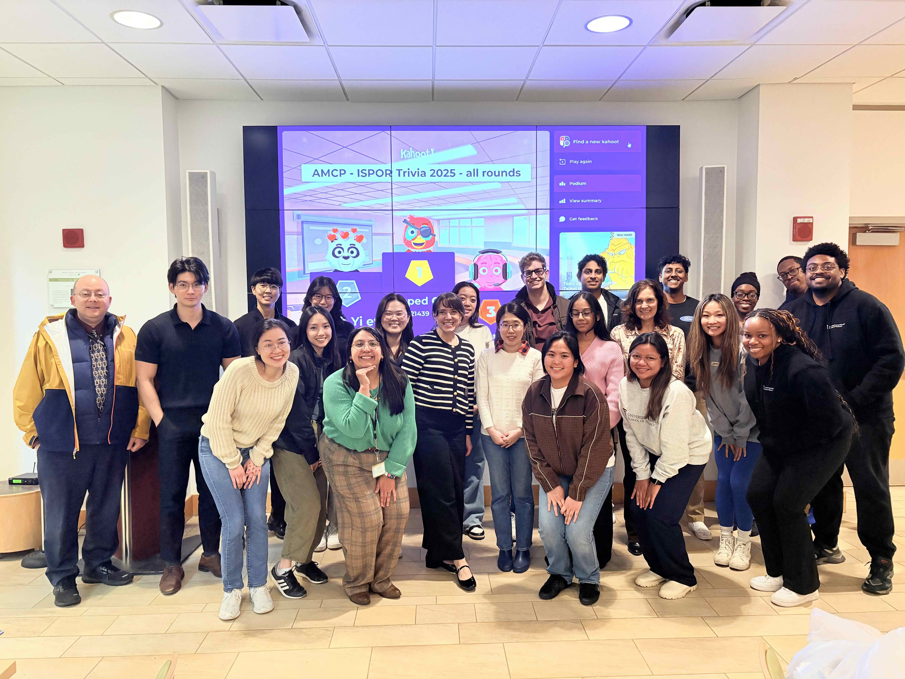
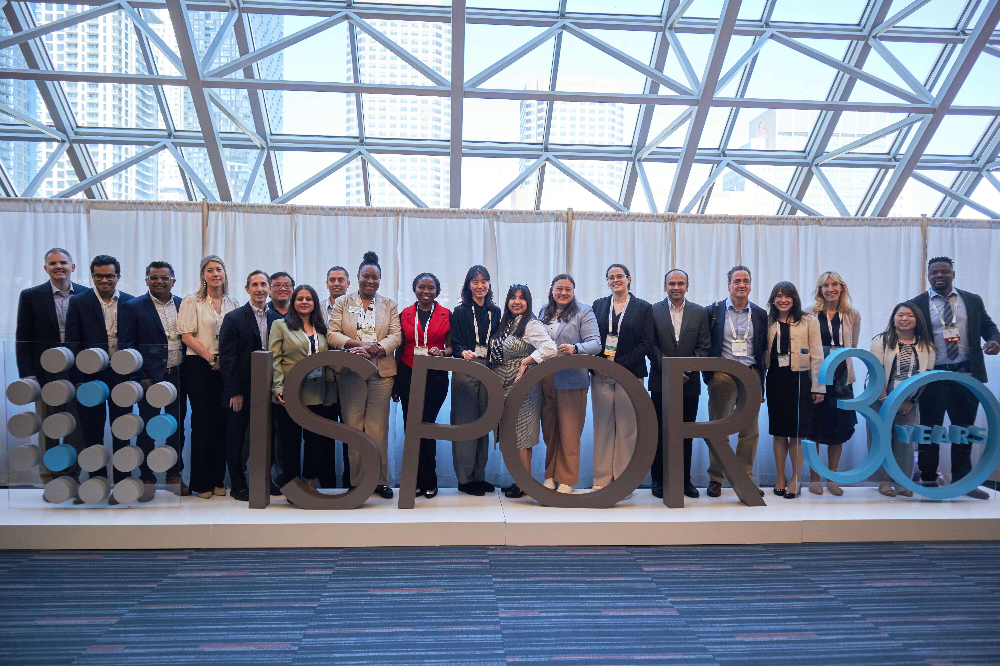
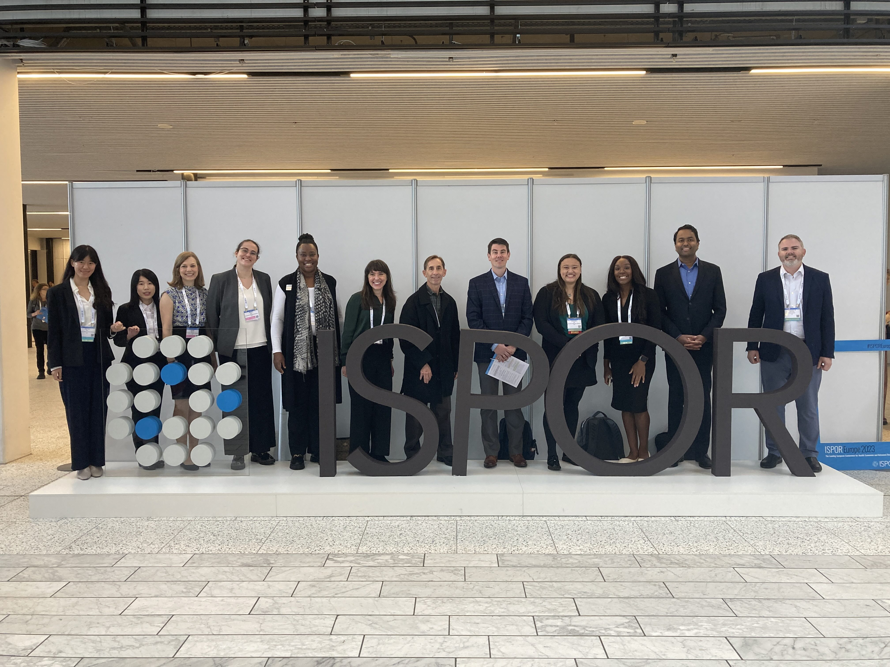
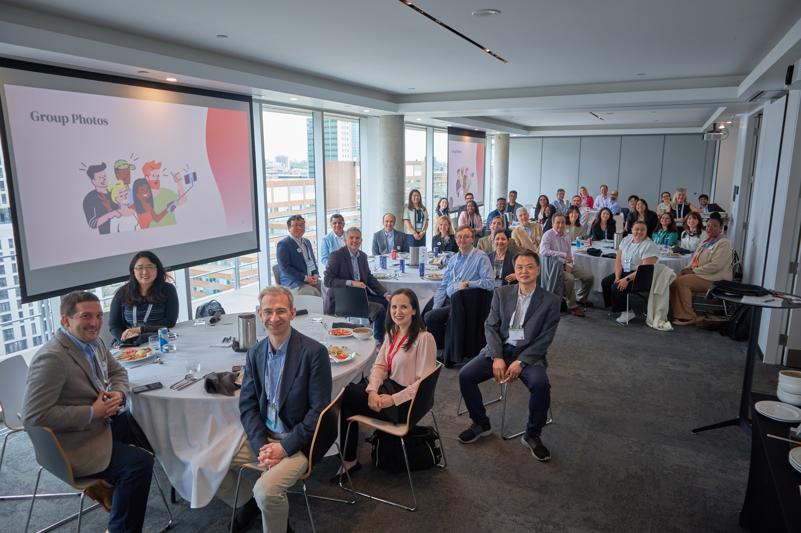
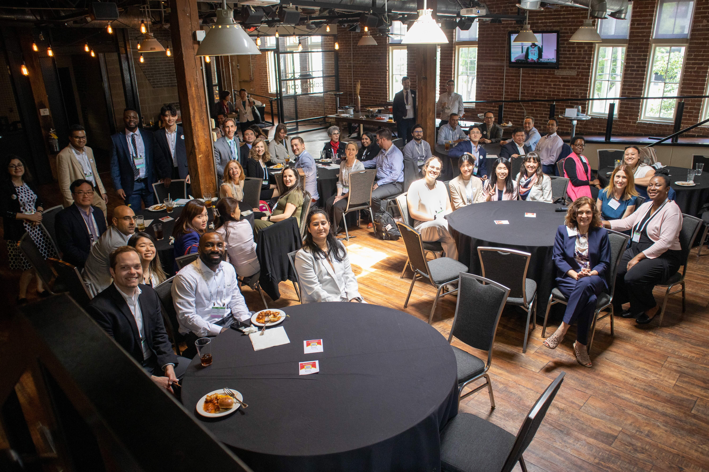

```{r setup, include=FALSE}
knitr::opts_chunk$set(echo = TRUE)
# Load necessary libraries
library(readr)
library(knitr)
library(DT)
library(dplyr)

```

```{css, echo=FALSE}
body, h1, h2, h3 {
  font-family: Helvetica;
}
h1 {
  font-weight: bold;
  color:#01ABE4;
  font-size: 28px;
}
h2 {
  font-weight: bold;
  font-size: 24px;
}
h3 {
  font-size: 20px;
}
body {
  font-size: 16px;
  line-height: 2; 
  margin-top: 16px;
}

/* Button */

.button {
  background-color: #01ABE4;
  border: none;
  color: white;
  padding: 8px 16px;
  text-align: center;
  text-decoration: none;
  display: inline-block;
  font-size: 16px;
  border-radius: 8px;
}


/* Table */
.custom-table {
  width: 100%;
  border-collapse: collapse;
}
.custom-table td {
  padding: 10px;
  border: 1px solid #ddd;
  text-align: left;
}
.custom-table .col1 {
  width: 30%;
  vertical-align: center;
}
.custom-table .col2 {
  width: 70%;
  vertical-align: top;
}


/* Card */
.card-container {
    display: grid;
    grid-template-columns: repeat(2, 1fr);
}
.card {
    background-color: #ffffff;
    border: 1px solid #e0e0e0;
    border-radius: 8px;
    padding: 20px;
    margin: 10px;
    /* Add more styles as needed */
}
.card-image {
    width: 100%; 
    border-top-left-radius: 8px;
    border-top-right-radius: 8px;
}
.card-title {
    font-size: 20px;
    margin-top: 20px;
    color:#01ABE4;
}
.card-description {
    font-size: 16px;
    line-height: 2; 
    color: #555;
}


/* Gallery */
div.gallery-container {
  display: flex;
  flex-wrap: wrap;
  justify-content: space-between;
  width: 100%; /* Ensures the gallery fits the full width of the page */
  box-sizing: border-box;
}
/* Each gallery item */
div.gallery {
  margin: 5px;
  border: 1px solid #ccc;
  width: calc(33.3333% - 10px); /* 3 items per row, accounting for margin */
  box-sizing: border-box;
}

div.gallery:hover {
  border: 1px solid #777;
}
/* Images within the gallery */
div.gallery img {
  width: 100%;
  height: auto;
  display: block;
  object-fit: cover;
  aspect-ratio: 4/3;
}

/* Description */
div.desc {
  padding: 15px;
  text-align: center;
}

```


<div class="gallery-container">

<div class="gallery">
  <a target="_blank" href="gallery/1.jpg">  </a>
  <div class="desc"> 2024-2025 E-board </div>
</div>

<div class="gallery">
  <a target="_blank" href="gallery/2.jpg">  </a>
  <div class="desc"> 2023-2024 E-board </div>
</div>

<div class="gallery">
  <a target="_blank" href="gallery/3.jpg">  </a>
  <div class="desc"> 2024 Fall Fest </div>
</div>

<div class="gallery">
  <a target="_blank" href="gallery/4.jpg">  </a>
  <div class="desc"> 2023 Fall Fest </div>
</div>

<div class="gallery">
  <a target="_blank" href="gallery/5.jpg">  </a>
  <div class="desc"> 2023 Fall Fest </div>
</div>

<div class="gallery">
  <a target="_blank" href="gallery/6.jpg">  </a>
  <div class="desc"> 2025 ISPOR x AMCP Trivia Night </div>
</div>

<div class="gallery">
  <a target="_blank" href="gallery/7.jpg">  </a>
  <div class="desc"> 2024 ISPOR x AMCP Trivia Night </div>
</div>

<div class="gallery">
  <a target="_blank" href="gallery/8.jpg">  </a>
  <div class="desc"> 2025 ISPOR </div>
</div>

<div class="gallery">
  <a target="_blank" href="gallery/9.jpg">  </a>
  <div class="desc"> 2024 ISPOR </div>
</div>

<div class="gallery">
  <a target="_blank" href="gallery/10.jpg">  </a>
  <div class="desc"> 2023 ISPOR Europe </div>
</div>

<div class="gallery">
  <a target="_blank" href="gallery/11.jpg">  </a>
  <div class="desc"> 2025 ISPOR Alumni Luncheon </div>
</div>

<div class="gallery">
  <a target="_blank" href="gallery/12.jpg">  </a>
  <div class="desc"> 2024 ISPOR Alumni Luncheon </div>
</div>


</div>

