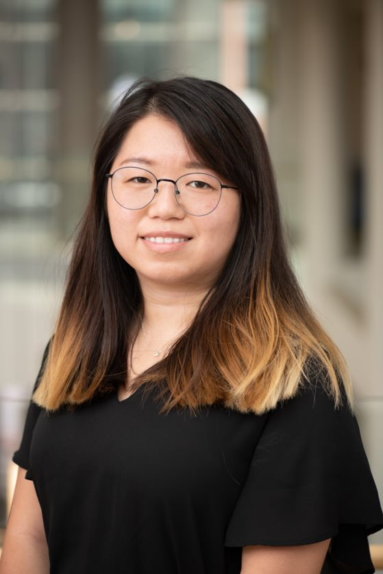
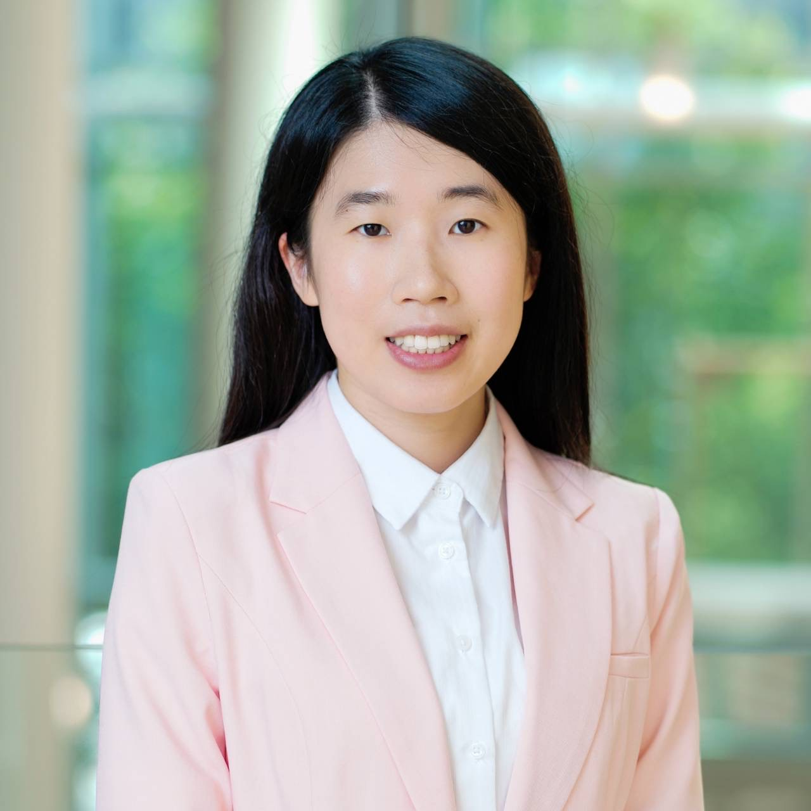

```{r setup, include=FALSE}
knitr::opts_chunk$set(echo = TRUE)
# Load necessary libraries
library(readr)
library(knitr)
library(DT)
library(dplyr)

```

# 2024-2025 Executive Board

<table class="custom-table">
  <tr>
    <td class="col1">{width="100%"} </td>
    <td class="col2"> **President** | Lynn (Pei-Lin) Huang </br> Lynn Huang earned her Master of Health Science degree in Health Economics and Outcomes Research from Johns Hopkins University. She also obtained a Bachelor's degree in Nutrition and Health Science from Taipei Medical University. Prior to entering the PHSR program, she worked as a data analyst at the University of Florida and as a Marketing Specialist at EMD Serono (Taiwan). Her research interest focuses on health disparities among individuals with cancer.
    </td>
    </tr>
  <tr>
  <tr>
    <td class="col1">{width="100%"} </td>
    <td class="col2"> **President-elect** | Hyung-Seok (John) Kim </br> Hello, you can call me John! I'm a 2nd year PhD student in the pharmacoeconomics track broadly interested in modeling and value assessment, especially in the realm of Alzheimer's disease. I've lived in Seoul, Singapore, Indonesia, and the US and can say without a doubt, that Indonesian food reigns supreme. I love lifting weights, playing the violin, and have a healthy but not so healthy obsession with karaoke. It's an absolute pleasure connecting with other peers in HEOR. and I can't wait to deepen my and our chapter's relationships with all of you reading this! 
    </td>
    </tr>
  <tr>
  <tr>
    <td class="col1">{width="100%"} </td>
    <td class="col2"> **Secretary** | Yu-Hua Fu </br> Yu-Hua is a second-year PhD student in Pharmaceutical Health Services Research at the University of Maryland, Baltimore. She holds a PharmD and a master's degree in Clinical Pharmacy from National Taiwan University, with experience in regulatory agencies, pharmaceutical companies, and clinical pharmacy practice. Now in her second year as a Peter Lamy pre-doctoral fellow, she focuses on drug safety and geriatric care. Her research interests include implementation research to improve healthcare efficiency, affordability, and equity. She previously served as Alumni and Public Relations Chair for UMB's ISPOR student chapter and will start her role as Secretary this year.
    </td>
    </tr>
  <tr>
  <tr>
    <td class="col1">{width="100%"}  </td>
    <td class="col2"> **Treasurer** | Jenny Contreras </br> Jenny Contreras is the Patient-Centric Value Assessment Pre-doctoral Fellow for Takeda and a PhD Candidate at the University of Maryland School of Pharmacy. She holds a BS in Public Affairs from the University of Texas at Dallas and an MPH in Health Services Organization from the University of Texas Health Science Center in Houston. Before her fellowship, Jenny interned with AstraZeneca's Oncology Outcomes Research group and worked as a Research Coordinator at both the University of Texas Health Science Center and MD Anderson, gaining extensive experience in patient-centered research. Her research interest is measuring shared decision making in oncology.
    </td>
    </tr>
  <tr>
  <tr>
    <td class="col1">{width="100%"} </td>
    <td class="col2"> **PharmD engagement chair** | Nikhil Reddy </br> Nikhil is a second-year PharmD doctoral candidate at the University of Maryland, Baltimore. After graduating from the University of Maryland, College Park with a degree in Neurobiology and Physiology, Nikhil decided to pursue a doctoral degree in pharmacy in hope of gaining insight into the intricacies of healthcare, pharmaceuticals, and patient care. In addition to ISPOR, Nikhil participates as a member in organizations such as IPhO, AMCP, and PDC as well as research projects for the UMSOP faculty. After graduation Nikhil hopes to pursue a fellowship within the pharmaceutical industry. 
    </td>
    </tr>
  <tr>
  <tr>
    <td class="col1"> {width="100%"} </td>
    <td class="col2"> **Alumni and public relations chair** | Chia-yun Hsu </br> Chia-Yun is a fourth-year PhD student in PHSR. As a former Secretary on the UMB ISPOR Student Chapter E-Board, she plans to build on the connections she has made with HEOR experts, alumni, and peers from other universities. In her new role as Alumni and Public Relations Chair, Chia-Yun aims to deepen these relationships through targeted media channels and personalized outreach. Stay tuned for her upcoming announcements about the exciting events that the UMB ISPOR Student Chapter will be hosting in the coming year!
    </td>
    </tr>
  <tr>
  <tr>
    <td class="col1">{width="100%"} </td>
    <td class="col2"> **Faculty advisor** | Julia Slejko, PhD </br> Dr. Slejko's research interests include applied health economic modeling, real-world health economics and outcomes research, and patient-informed value assessment. She holds a BA in Molecular, Cellular and Developmental Biology from the University of Colorado Boulder. Her PhD training at the University of Colorado School of Pharmacy Center for Pharmaceutical Outcomes Research was focused on pharmacoeconomics. Her postdoctoral training was completed at the Pharmaceutical Outcomes Research and Policy Program in the University of Washington School of Pharmacy. Prior to her PhD training, she had a seven-year career in drug discovery at Array BioPharma in Boulder, CO. Dr. Slejko is very active in ISPOR---The Professional Society for Health Economics and Outcomes Research, where she serves as co-lead of ISPOR's Women in HEOR initiative, Co-Chair of the ISPOR Faculty Advisor Council and is a member of ISPOR's Health Science Policy Council.
    </td>
    </tr>
  <tr>
</table>
